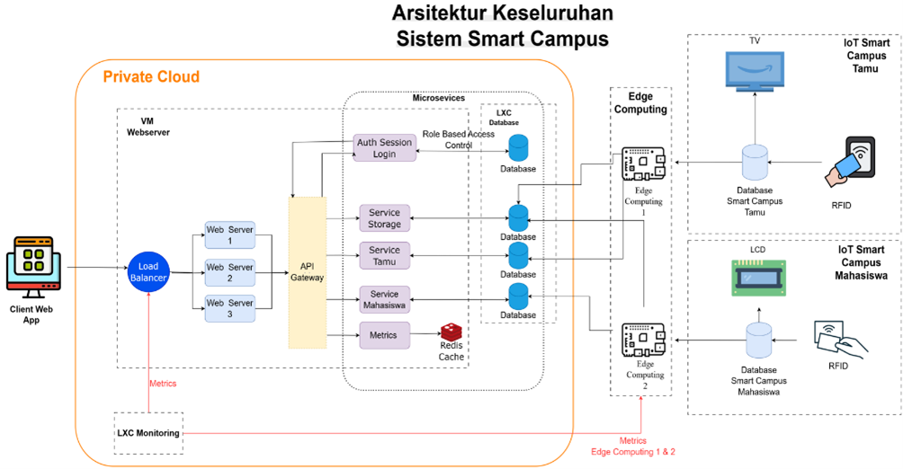
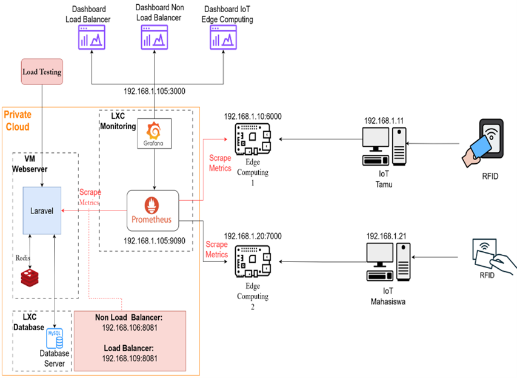
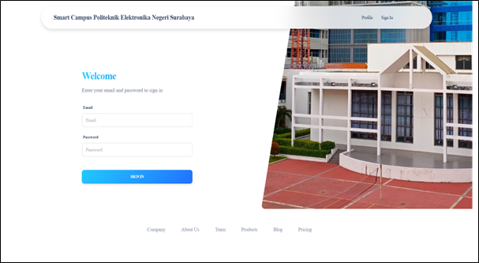
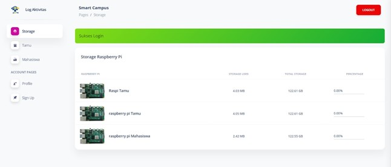

# CBIS (Cloud-Based Information System) Smart Campus

Proyek ini adalah **aplikasi web dashboard CBIS (Cloud-Based Information System)** berbasis **Laravel** yang didukung dengan **Load Balancing (ALB Round Robin)**, **Redis Cache**, dan **Monitoring dengan Grafana & Prometheus**.
Selain itu, sistem ini terintegrasi dengan **Edge Computing** dan **IoT devices** (seperti RFID), yang memungkinkan pemrosesan data secara real-time di **MySQL Edge Device** serta ditampilkan langsung di **perangkat visualisasi** (misalnya TV Display).

---

## ✨ Fitur Utama

* **Web Dashboard berbasis Laravel**

  * Login & autentikasi user
  * Dashboard interaktif dengan data real-time
* **Load Balancer Round Robin (Nginx / ALB)**

  * Distribusi traffic secara merata antar instance aplikasi
  * Meningkatkan ketersediaan (High Availability)
* **Redis Cache**

  * Optimasi query database
  * Menjamin integritas dan konsistensi data
* **Monitoring & Observability**

  * **Prometheus** untuk scraping metrics
  * **Grafana** untuk visualisasi performa & kesehatan sistem
* **Edge Computing & IoT**

  * Integrasi dengan **RFID reader**
  * Pemrosesan data di **MySQL Edge Device**
  * Streaming data ke dashboard secara real-time
  * Visualisasi di perangkat display (TV, panel, dll.)

---


## 🏗️ Arsitektur Sistem

### 1. **Arsitektur Keseluruhan**



Arsitektur ini mengintegrasikan **private cloud** dengan **edge computing** untuk mendukung aplikasi web dashboard CBIS.

* **Client** mengakses aplikasi melalui jaringan privat.
* **Nginx Load Balancer** mendistribusikan traffic ke tiga **web server** (App 1, App 2, App 3) menggunakan metode **round robin**.
* Ketiga web server terhubung ke **MySQL Database** untuk menjaga konsistensi dan integritas data.
* **Edge Computing + IoT (RFID)** memproses data secara real-time pada **MySQL Edge Device** dan menampilkannya di perangkat visualisasi (misalnya TV), sehingga latensi berkurang dan kinerja sistem meningkat.

---

### 2. **Arsitektur Monitoring**



Arsitektur monitoring mendukung **ketersediaan, skalabilitas, dan observabilitas** sistem:

* **Prometheus** mengumpulkan metrik dari aplikasi Laravel, Redis, MySQL, dan load balancer.
* **Grafana** menampilkan metrik dalam dashboard (Load Balancer, Non Load Balancer, IoT Edge).
* **Edge Computing** mengirim data IoT (RFID) untuk dipantau secara real-time.

Integrasi ini memastikan sistem tetap **handal, efisien, dan adaptif** terhadap beban operasional yang dinamis.

---

## 📊 Tampilan Aplikasi

### 🔐 Halaman Login




### 📈 Dashboard Utama




---

## ⚙️ Teknologi yang Digunakan

* **Backend**: Laravel 10 (PHP Framework)
* **Database**: MySQL (Cloud & Edge Device)
* **Cache**: Redis
* **Load Balancer**: Nginx (Round Robin Method)
* **Monitoring**: Prometheus + Grafana
* **IoT & Edge**: RFID Reader + Edge Computing Device
* **Containerization**: Docker & Docker Compose

---

## 🚀 Cara Menjalankan

1. Clone repository

   ```bash
   git clone -b alb https://github.com/alimusyafa-psc/projectsmartcampus.git
   cd projectsmartcampus
   ```
2. Jalankan dengan Docker Compose

   ```bash
   docker-compose up -d
   ```
3. Akses aplikasi di browser

   ```
   http://localhost:8080
   ```

---

## 📌 Catatan

* Pastikan **Docker** dan **Docker Compose** sudah terinstal.
* Gunakan **environment file (.env)** untuk konfigurasi database, cache, dan monitoring.
* Dokumentasi tambahan tersedia pada folder `docs/`.

---

## 📜 Lisensi

Proyek ini dikembangkan untuk kebutuhan **Smart Campus CBIS** dan bersifat open source.

---
